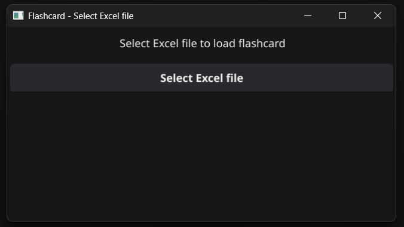
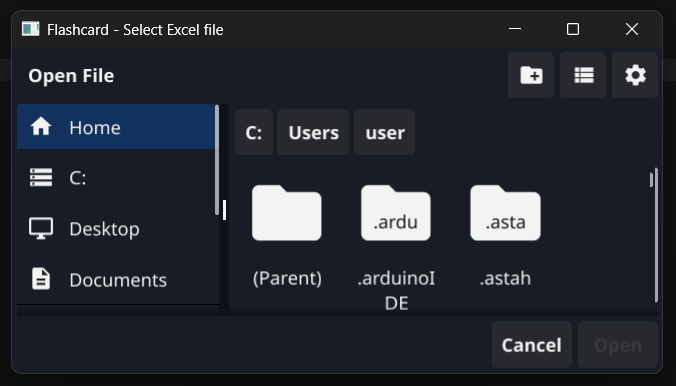
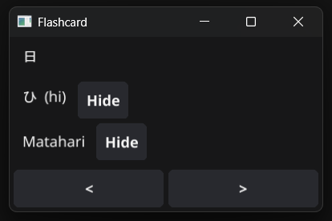

# Japanese Flashcard Application

A simple flashcard application for learning Japanese vocabulary with a GUI interface using Fyne.

Aplikasi flashcard sederhana untuk belajar kosakata bahasa Jepang dengan antarmuka GUI menggunakan Fyne. Kini mendukung upload file Excel!

## Features

- 📚 Display Japanese vocabulary (Kanji, Hiragana, Reading, Meaning)
- ⏭️ Navigate forward/backward between cards
- 👁️ Toggle to hide/show readings and meanings
- 📱 Simple and user-friendly GUI interface
- 📊 Upload and read data from Excel files (.xlsx, .xls)
- 📁 File selection dialog to choose any Excel file

## Prerequisites

### Windows
1. **Install GCC Compiler**
   - Download and install TDM-GCC from: https://jmeubank.github.io/tdm-gcc/
   - Or install MinGW-w64

2. **Install Go**
   - Download from: https://golang.org/dl/
   - Minimum version: Go 1.16+

## Installation

1. **Clone or download this project**
2. **Install dependencies:**
   ```bash
   go mod tidy
   ```

3. **Prepare your Excel file** with the format:
   | Kanji | Hiragana | Reading | Meaning |
   |-------|----------|---------|---------|
   | 私 | わたし | watashi | I/me |
   | 本 | ほん | hon | book |
   
   Save as `.xlsx` or `.xls` format

## Excel File Format

Your Excel file must have the following structure:
- **Sheet1** with columns:
  - Column A: Kanji
  - Column B: Hiragana  
  - Column C: Reading (romaji)
  - Column D: Meaning (Indonesian/English)
- First row as header (will be ignored)
- Supports both `.xlsx` and `.xls` formats

## How to Run

### Run directly
```bash
go run main.go
```

### Compile to executable
```bash
# For Windows
go build -ldflags="-H windowsgui" -o flashcard.exe main.go
```

After compilation, you can simply double-click the `flashcard.exe` file to run it.

### Cross-compile for other OS
```bash
# For Linux from Windows
set GOOS=linux
set GOARCH=amd64
go build -o flashcard-linux main.go

# For macOS from Windows  
set GOOS=darwin
set GOARCH=amd64
go build -o flashcard-mac main.go
```

## Usage

1. Run the application
2. Click "Select Excel file" button to choose your vocabulary file
3. Browse and select your `.xlsx` or `.xls` file containing Japanese vocabulary
4. Once loaded, use `<` and `>` buttons for navigation
5. Click "Hide" button to hide reading or meaning
6. Study vocabulary by hiding answers first

### File Selection Interface
The application will display a welcome screen asking you to select an Excel file. The file dialog supports both `.xlsx` and `.xls` formats.

## Screenshots

### Step 1: Welcome Screen


### Step 2: File Selection


### Step 3: Flashcard Interface


## Troubleshooting

### Error "gcc not found"
- Install TDM-GCC or MinGW-w64
- Make sure gcc is in PATH

### Error loading Excel file
- Make sure the selected file is in `.xlsx` or `.xls` format
- Check that the Excel file has the correct column structure
- Ensure the file is not corrupted or password protected
- Verify the file contains data in the expected format

### GUI doesn't appear
- Make sure all Fyne dependencies are installed
- Try running: `go mod tidy`

## Dependencies

- `github.com/xuri/excelize/v2` - for reading Excel files
- `fyne.io/fyne/v2` - for GUI framework

## Contributing

Please create issues or pull requests for improvements and new features.

## License

This project is free to use for educational purposes.
